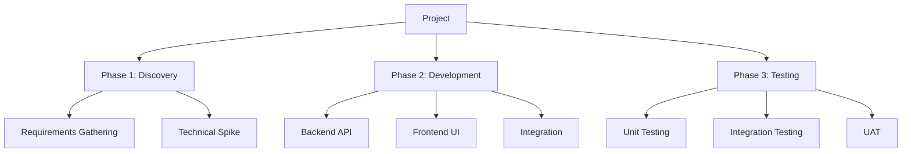
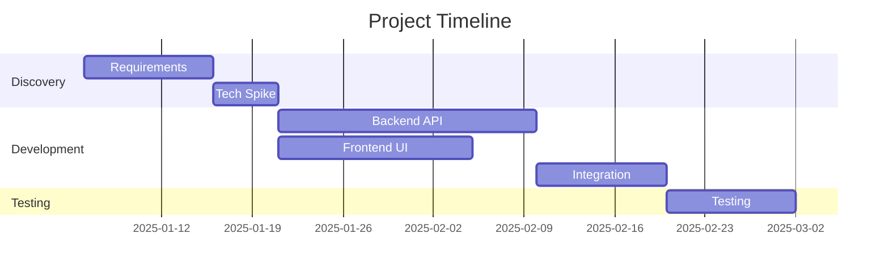

# Consolidation Guide

## Purpose

This document describes how to merge the outputs of the three estimation sub-agents (PERT, WBS,
T-Shirt) into a single, coherent estimation document. It also contains the document templates
for each audience type.

---

## Part 1: Consolidation Methodology

### Step 1: Load and Parse Results

Read the three JSON files:
- `estimates/pert.json`
- `estimates/wbs.json`
- `estimates/tshirt.json`

Extract the headline numbers from each:
- PERT: `totals.expected` and `totals.confidence_95`
- WBS: `totals.with_overhead`
- T-Shirt: `totals.midpoint` and `[totals.optimistic, totals.conservative]`

### Step 2: Alignment Analysis

Calculate the **spread** across frameworks:

```
spread = (max_estimate - min_estimate) / average_estimate × 100%
```

Classify:

| Spread | Alignment | Confidence | Action |
|--------|-----------|------------|--------|
| < 20% | Strong | High | Report with confidence |
| 20–50% | Partial | Medium | Investigate divergence |
| > 50% | Divergent | Low | Flag major uncertainty, explain causes |

For each pair of frameworks, note where they agree and disagree at the item level (not just
totals). The most valuable insight is often in the specific items where estimates diverge.

### Step 3: Root-Cause Divergence

When frameworks disagree, the cause is usually one of:

1. **Scope gap**: WBS found work that PERT and T-Shirt missed (e.g., deployment, testing). The
   WBS is probably more accurate here.
2. **Risk disagreement**: PERT's pessimistic bound is much higher than WBS total. This means
   PERT sees risks that WBS hasn't accounted for in buffer.
3. **Granularity mismatch**: T-shirt sizing lumped items that WBS decomposed, causing the T-shirt
   total to miss compounding effort.
4. **Calibration drift**: T-shirt size mappings don't match the project's actual scale. Adjust
   the mapping table.

Document the likely cause for each significant divergence.

### Step 4: Produce the Consolidated Estimate

The consolidated estimate uses a **tiered recommendation**:

```
┌─────────────────────────────────────────────────────┐
│  RECOMMENDED ESTIMATE                                │
│                                                      │
│  Optimistic:    [lower bound]     "if things go well"│
│  Expected:      [central value]   "our best guess"   │
│  Conservative:  [upper bound]     "if things go badly"│
│                                                      │
│  Confidence:    [0–100%]                             │
│  Unit:          [person-days / hours / etc.]         │
└─────────────────────────────────────────────────────┘
```

How to derive each:

- **Expected**: Weighted blend. Use PERT expected as the base. If WBS is higher (it usually is
  because it finds more scope), shift the expected toward the WBS number. Formula:
  `Expected = 0.4 × PERT_expected + 0.4 × WBS_with_overhead + 0.2 × TShirt_midpoint`

- **Optimistic**: `min(PERT_confidence_95_low, TShirt_optimistic)` but never below 70% of
  Expected.

- **Conservative**: `max(PERT_confidence_95_high, WBS_with_overhead × 1.15)` — take the higher
  of PERT's statistical upper bound or WBS + 15% for unknown unknowns.

- **Confidence score**: Start at 100%, deduct:
  - 10% for each framework pair with > 30% divergence
  - 5% for each assumption rated "fragile" or "unverified"
  - 5% if any item is marked XXL / needs decomposition
  - 10% if the project is novel (no historical reference)
  - Floor at 20%

### Step 5: Merge Risk Registers

Collect risks from all three frameworks. Deduplicate by grouping similar risks. For each unique
risk:

- **Probability**: Low / Medium / High
- **Impact**: Days or percentage of total estimate
- **Source**: Which framework(s) flagged it
- **Mitigation**: Suggested action

Sort by `probability × impact` descending.

### Step 6: Merge Assumptions

Collect all assumptions. Deduplicate. For each, rate fragility:

- **Solid**: Based on evidence, unlikely to change
- **Reasonable**: Seems right but unverified
- **Fragile**: Could easily be wrong, would significantly affect estimate

---

## Part 2: Document Templates

### Template Selection

| Audience | Detail Level | Template |
|----------|-------------|----------|
| Executive | Quick | Executive One-Pager |
| Executive | Standard | Executive Summary + Appendix |
| Technical | Any | Technical Estimation Report |
| Hybrid | Quick | Hybrid Brief |
| Hybrid | Standard/Comprehensive | Full Hybrid Report |

---

### Template A: Executive One-Pager

Use for: executive audience + quick detail level.

```
# [Project Name] — Estimation Summary

## Bottom Line

[1–2 sentence summary: "We estimate [project] will take [range] [unit], with
[confidence]% confidence. The primary risk is [top risk]."]

## Estimate at a Glance

| Scenario | Estimate | Likelihood |
|----------|----------|------------|
| Optimistic | [X] [unit] | If things go well |
| Expected | [X] [unit] | Our best guess |
| Conservative | [X] [unit] | If we hit obstacles |

**Confidence: [X]%** — [one sentence explaining why]

## Key Risks (Top 3)

1. [Risk] — [impact in plain language]
2. [Risk] — [impact in plain language]
3. [Risk] — [impact in plain language]

## Critical Assumptions

- [Assumption 1]
- [Assumption 2]
- [Assumption 3]
```

---

### Template B: Executive Summary + Appendix

Use for: executive audience + standard detail level.

```
# [Project Name] — Estimation Report

## Executive Summary

[2–3 paragraphs: what was estimated, the recommended range, confidence level,
the approach used (three independent frameworks), and the top concerns.]

## Estimate Overview

[Comparison table: 3 frameworks side-by-side]
[Confidence gauge visual if format supports it]
[Recommended range with explanation]

## Effort Distribution

[Pie or bar chart showing effort by phase/area]
[Brief narrative explaining the distribution]

## Risk Assessment

[Top 5 risks in a table: risk, probability, impact, mitigation]
[Risk matrix visual if complexity warrants it]

## Assumptions & Constraints

[Grouped by fragility: solid / reasonable / fragile]

## Appendix: Framework Details

### A1. PERT Analysis
[Summary table of items with O/M/P/E]

### A2. WBS Summary
[Phase-level rollup, not full tree]

### A3. T-Shirt Sizing
[Size distribution and mapping table]
```

---

### Template C: Technical Estimation Report

Use for: technical audience, any detail level.

```
# [Project Name] — Technical Estimation

## Methodology

[Brief description of the triangulated approach and why three frameworks]

## Consolidated Estimate

### Recommended Range
[Table with optimistic / expected / conservative]
[Confidence score with breakdown of deductions]

### Framework Comparison
[Detailed side-by-side comparison table]
[Item-level divergence analysis]

## PERT Analysis

[Full PERT table with all items: O, M, P, E, σ]
[Confidence intervals at 68%, 95%]
[High-variance items flagged]

## Work Breakdown Structure

[Full WBS tree (Mermaid diagram for standard+)]
[Work packages with effort, role, dependencies]
[Critical path identified]
[Overhead breakdown]

## T-Shirt Sizing

[Sizing map with all items]
[Size-to-effort mapping table]
[Distribution chart]
[Items needing decomposition]

## Risk Register

[Full risk table: description, probability, impact, source framework, mitigation]
[Risk matrix (probability × impact)]

## Assumptions

[Full list with fragility ratings]

## Scope Exclusions

[What is explicitly NOT estimated]

## Resource Mapping

[By role: who is needed, for how long]
[Team composition recommendations]

## Dependencies & Sequencing

[Mermaid Gantt chart for standard+ detail]
[Critical path narrative]
```

---

### Template D: Hybrid Brief (Quick)

Use for: hybrid audience + quick detail level.

```
# [Project Name] — Estimation Brief

## For Decision Makers

[2–3 sentences: the number, the confidence, the top risk]

| Scenario | Estimate |
|----------|----------|
| Optimistic | [X] |
| Expected | [X] |
| Conservative | [X] |

## For the Team

[Comparison table across 3 frameworks]
[Top 5 risks with probability and impact]
[Key assumptions]
[Suggested next steps]
```

---

### Template E: Full Hybrid Report (Standard / Comprehensive)

Use for: hybrid audience + standard or comprehensive detail level.

```
# [Project Name] — Estimation Report

---

## Part I: Executive Summary (for stakeholders)

[Everything from Template B's executive section]
[Effort distribution visual]
[Risk traffic lights]

---

## Part II: Technical Analysis (for the team)

[Everything from Template C's technical sections]
[WBS tree]
[PERT tables]
[T-Shirt sizing map]
[Dependency graph / Gantt]

---

## Part III: Appendices

### Appendix A: Full Risk Register
### Appendix B: Complete Assumptions List
### Appendix C: Scope Exclusions
### Appendix D: Methodology Notes
### Appendix E: Raw Estimation Data (JSON references)
```

---

## Part 3: Visual Element Guidelines

### When to Include Visuals

The rule: visuals should accelerate comprehension, not decorate. Use the matrix from SKILL.md
to decide which visuals to include based on audience and detail level.

### Mermaid Diagram Examples

**WBS Tree:**


**Gantt Chart:**


**Risk Matrix (as a table):**
```
|              | Low Impact | Medium Impact | High Impact |
|--------------|-----------|---------------|-------------|
| High Prob.   | ⚠️ Watch  | 🔴 Mitigate   | 🔴 Mitigate  |
| Medium Prob. | ✅ Accept  | ⚠️ Watch      | 🔴 Mitigate  |
| Low Prob.    | ✅ Accept  | ✅ Accept      | ⚠️ Watch     |
```

### Language Adaptation

All template headings, labels, and prose must be translated to the user's chosen language.
Translate naturally — don't do literal word-for-word translation. Adapt idioms and business
terminology to what professionals in that language would actually use:

- "Bottom Line" → "Kernboodschap" (NL), "Fazit" (DE), "L'essentiel" (FR)
- "Risk Register" → "Risicoregister" (NL), "Risikoregister" (DE)
- "Assumptions" → "Aannames" (NL), "Annahmen" (DE), "Hypothèses" (FR)

Use the language that feels professional and natural in local business contexts.
